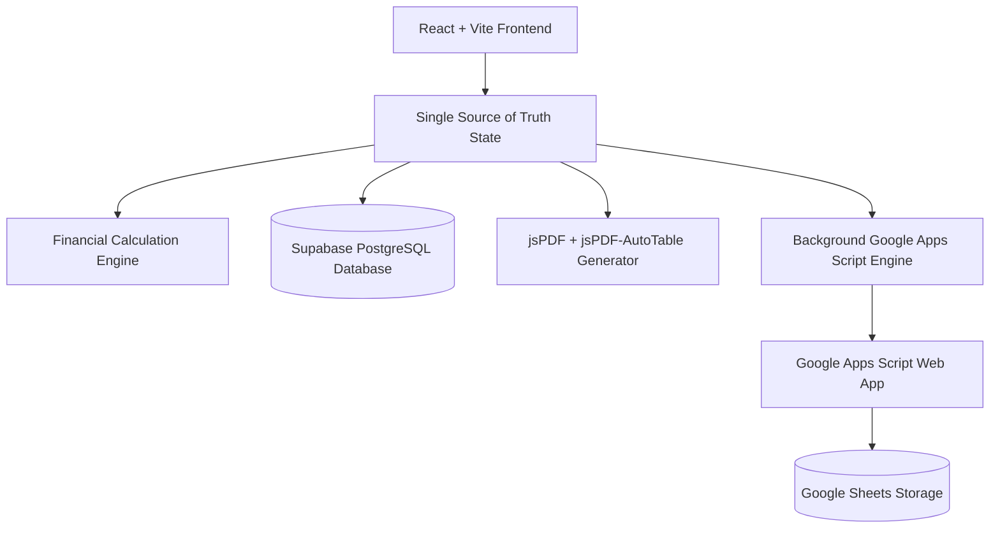

# 🌟 Al Uzer Common Services — CRM & Business Management System

A full-featured, enterprise-grade business management and customer relationship management (CRM) application built specifically for **Al Uzer Common Services** to streamline customer workflows, financial ledgering, expense tracking, daily counter sales (Kirkol), automated A4 PDF reports, and real-time bidirectional Google Sheets cloud sync.

---

## 📑 Table of Contents

1. [System Architecture & Tech Stack](#-system-architecture--tech-stack)
2. [Core Features & Modules](#-core-features--modules)
   - [1. Job Management & Live Status Filtering](#1-job-management--live-status-filtering)
   - [2. Customer Directory & Operations](#2-customer-directory--operations)
   - [3. Business Spending & Expense Tracking](#3-business-spending--expense-tracking)
   - [4. Kirkol (Miscellaneous Counter Income)](#4-kirkol-miscellaneous-counter-income)
   - [5. Categories & Work Status Customization](#5-categories--work-status-customization)
   - [6. Publication-Ready PDF Monthly Reports](#6-publication-ready-pdf-monthly-reports)
   - [7. Real-Time Google Sheets Cloud Sync](#7-real-time-google-sheets-cloud-sync)
3. [Financial Formula Engine](#-financial-formula-engine)
4. [Step-by-Step Google Apps Script Setup Guide](#-step-by-step-google-apps-script-setup-guide)
5. [Local Development & Deployment](#-local-development--deployment)
6. [Project File Structure](#-project-file-structure)
7. [Troubleshooting & Common Questions](#-troubleshooting--common-questions)

---

## 🏗 System Architecture & Tech Stack



- **Frontend Core**: React 18, TypeScript, Vite
- **UI & Design System**: Custom Vanilla CSS Design System with dark accents, responsive data tables, glassmorphism cards, and micro-interactions
- **Icons**: Lucide React
- **Database & Persistence**:
  - Primary: Supabase (PostgreSQL)
  - Secondary / Live Cloud Backup: Google Sheets (Google Drive)
  - Offline Fallback: Browser LocalStorage
- **PDF Generation**: `jspdf` and `jspdf-autotable`

---

## ⚡ Core Features & Modules

### 1. Job Management & Live Status Filtering
- **Status Filter Ribbon**: Instant single-click filtering across all business job statuses:
  - `ALL`: Displays all active jobs with total record count.
  - `PENDING`: Shows jobs with unpaid or pending work status.
  - `IN PROGRESS`: Dedicated filter for customer documents currently in progress.
  - `AL UZER`: Instant one-click filter for jobs under Al Uzer services.
  - `DELIVERED`: Shows all successfully delivered customer orders.
  - `DOCUMENT REQUIRED`: Filters jobs waiting for customer document submission.
  - `COMPLETED`: Shows finished jobs ready for handover or archival.
- **Top Financial Summary Cards**:
  - **Total Jobs**: Live filtered count.
  - **Total Amount**: Gross turnover of displayed jobs.
  - **Received Amount**: Total cash/UPI collected.
  - **Pending Amount**: Outstanding customer credit highlighted with warning badges.
- **Live Search**: Multi-field search across customer name, mobile number, work type, and status with a one-click `✕` clear button.

---

### 2. Customer Directory & Operations
- **Customer Profiles**: Record customer full name, mobile number, assigned service type, delivery status, and payment logs.
- **Work Type Selector**: Auto-populates official government fees and profit margins.
- **Dynamic Payment Status**: Automatically badges orders as `PAID`, `PARTIAL`, or `PENDING`.
- **Inline Editing & Quick Actions**: Modify or delete records with recalculation of all dashboard metrics.

---

### 3. Business Spending & Expense Tracking
- **Expense Logging**: Track operational outlays (e.g. Shop Rent, Electricity, Internet/WiFi, Stationary, Paper reams, Printer toner, Machine repairs).
- **Categorization**: Group expenses under configurable categories (Business, Utilities, Office supplies, Personal).
- **Net Balance Impact**: Business spendings are deducted directly from customer profit to show true bottom-line cash in hand.

---

### 4. Kirkol (Miscellaneous Counter Income)
- **Fast Quick-Add**: Fast-entry modal for daily counter income (Xerox, Printout, Scanning, Lamination, Photo copies, Ticket bookings).
- **Direct Profit**: Kirkol revenue is added directly to total monthly income.

---

### 5. Categories & Work Status Customization
- Easily add, rename, or delete spending categories and work statuses from the Settings page.
- Changes propagate across all modals and dropdowns.

---

### 6. Publication-Ready PDF Monthly Reports
- **Official Header**: Branded with *AL UZER COMMON SERVICES* and report generation timestamps.
- **KPI Summary Grid**: Total Turnover, Collected, Outstanding Balance, Kirkol Revenue, Operating Expenses, and Net Profit.
- **Itemized Ledger Tables**: Complete transaction log of all jobs and expenses.
- **Print Optimization**: Formatted for standard A4 portrait with multi-page table wrapping.

---

### 7. Real-Time Google Sheets Cloud Sync
- **Automatic Background Sync**: Whenever you create or edit a customer, spending, or Kirkol item, it is automatically posted in the background to your Google Spreadsheet.
- **Structured Monthly Sheets**: Automatically generates clean tabs (e.g. `September 2026`) with summary KPI cards, INR (`₹`) formatting, and color-coded rows.
- **Annual Overview Tab**: Automatically creates a 12-month annual overview breakdown.

---

## 🔢 Financial Formula Engine

The application implements a single source of truth for all business accounting:

| Metric | Formula |
| :--- | :--- |
| **Customer Balance** | $\text{Total Amount} - \text{Paid Amount}$ |
| **Customer Income (Profit)** | $\text{Total Amount} - \text{Work Expense}$ |
| **Total Business Income** | $\sum \text{Customer Income} + \sum \text{Kirkol Revenue}$ |
| **Total Business Spending** | $\sum \text{Direct Recorded Spendings}$ |
| **Net Remaining Amount (Profit in Hand)** | $\mathbf{\text{Total Business Income} - \text{Total Business Spending}}$ |

---

## 🛠 Step-by-Step Google Apps Script Setup Guide

### 1. Open Google Sheets & Apps Script
1. Open your target Google Sheet (e.g. [Al Uzer Services Spreadsheet](https://docs.google.com/spreadsheets/d/1pHMlFy-Qn1u4ssrYnyUR_uwvFbt2xveaPOZW5JY7V_I/edit?gid=0#gid=0)).
2. In the top Google Sheets menu, click: **Extensions** → **Apps Script**.
3. Delete any code in the editor.
4. Copy and paste the complete script from [`src/google-apps-script.js`](./src/google-apps-script.js).
5. Press `Ctrl + S` to save.

### 2. Deploy as Web App
1. Click the blue **Deploy** button (top right) → **New deployment**.
2. Click the gear icon ⚙️ next to *Select type* and choose **Web app**.
3. Configure the following:
   - **Description**: `Al Uzer CRM Sync Web App`
   - **Execute as**: **`Me (your email)`**
   - **Who has access**: **`Anyone`** *(🚨 Essential: Must be "Anyone" so the browser can post data without Google 401 permission blocks)*.
4. Click **Deploy**.
5. Copy the generated **Web app URL** (`https://script.google.com/macros/s/.../exec`).

### 3. Connect to Web App
1. In the CRM web application, go to the **Google Sheets** tab in the sidebar.
2. Paste the Web App URL into the URL input and click **Save Settings**.
3. Click **"Sync To Google Sheets"** to push all current records into your spreadsheet!

---

## 💻 Local Development & Deployment

### Prerequisites
- [Node.js](https://nodejs.org/) (v18 or higher)
- npm or yarn

### Commands
```bash
# 1. Install dependencies
npm install

# 2. Start local Vite development server
npm run dev

# 3. Build optimized production bundle
npm run build
```

---

## 📂 Project File Structure

```
├── src/
│   ├── App.tsx                      # Root application & state coordinator
│   ├── CRMDashboard.tsx             # Job Management with status filter bar
│   ├── CustomersPage.tsx            # Customer directory & job details
│   ├── CustomerModal.tsx            # Create/Edit customer dialog
│   ├── SpendingPage.tsx             # Expense tracker page
│   ├── SpendingModal.tsx            # Create/Edit expense dialog
│   ├── KirkolModal.tsx              # Quick counter sales dialog
│   ├── CategoriesAndStatusesPage.tsx# Settings for categories and statuses
│   ├── GoogleSheetsPage.tsx         # Google Sheets sync & setup guide
│   ├── googleSheetsSync.ts          # Real-time background auto-sync engine
│   ├── google-apps-script.js        # Google Apps Script Web App code
│   ├── pdfReport.ts                 # PDF report generator engine
│   ├── types.ts                     # TypeScript data models & calculations
│   └── index.css                    # Main design system & responsive styling
├── README.md                        # Complete project documentation
└── package.json
```

---

## ❓ Troubleshooting & Common Questions

#### Q: Data is not showing up in Google Sheets after saving a record.
1. Make sure your Google Apps Script is deployed with **Who has access: "Anyone"**. If set to "Only myself", Google blocks external web requests with `401 Unauthorized`.
2. Go to **Deploy** → **Manage deployments** → Click **Edit (✏️)** → Select **Version: New version** → Set **Who has access: Anyone** → Click **Deploy**.
3. Make sure the Web App URL is saved in the **Google Sheets** page in your CRM app.

#### Q: Where is data stored if Google Sheets is offline?
- The app stores all data locally in the browser (`localStorage`) and in your Supabase database. You can click **"Sync To Google Sheets"** at any time to push all records.
>>>>>>> b4377bb (Add project files and features)
